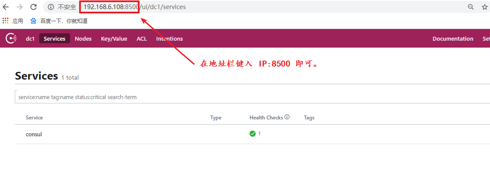
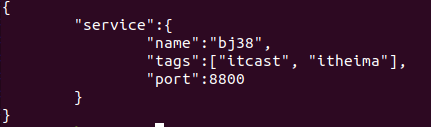
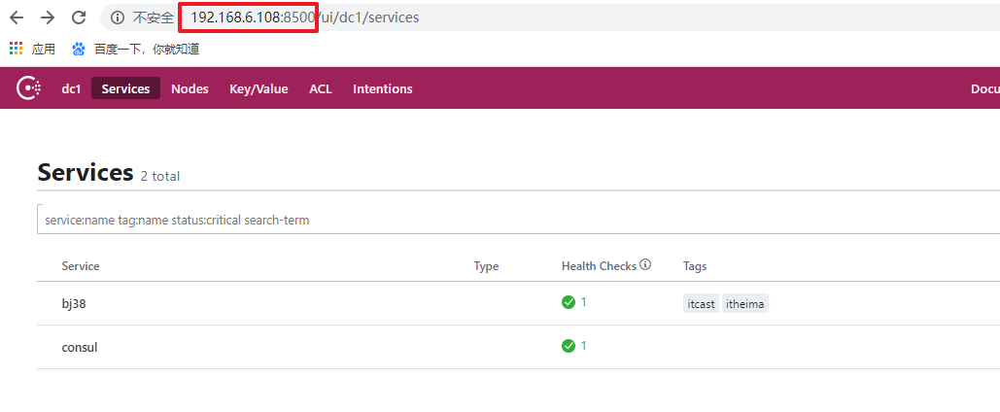

# 作业：grpc 远程调用。

- 服务端 grpc 
    1. 初始一个 grpc 对象
    2. 注册服务
    3. 设置监听， 指定 IP、port
    4. 启动服务。---- serve()
- 客户端 grpc
    1. 连接 grpc 服务
        1. 给 grpc.Dial() 传参2 ： grpc.WithInsecure()  .  表示：以安全的方式操作。
    2. 初始化 grpc 客户端
    3. 调用远程服务。
        1. 给 grpc.SayHello() 传参1： context.TODO() 表示：空对象。

# go-mirco

## micro 简介

- go-micro：微服务开发使用资源库。添加 RCP、GRPC
- micro：微服务开发的生态。包含 微服务命令、API、插件。。。
- go-plugins：微服务使用的插件。（新版微服务，舍弃了旧版的内容。）
- 服务发现：微服务开发的核心

从 github 搜索 micro


## 服务发现

- 是微服务开发中，必须的 核心技术


- **==服务发现，也可以看做一个 “服务”， 是给 “服务” 提供服务的。==**


### 有服务发现后，client、server工作流程：

1. 每个server启动时，都将自己的IP、port 和 服务名 注册给 ”服务发现“
2. 当 client 向服务发现发起服务请求时， “服务发现” 会自动找一个可用的 服务，将其 IP/port/服务名返回给 client
3. client 再借助服务发现，访问 server。


### 服务发现的种类：

- consul： 常应用于 go-micro 中。
- mdns：go-micro中默认自带的服务发现。
- etcd：k8s 内嵌的服务发现
- zookeeper：java中较常用。

### consul 关键特性

1. 服务发现： consul 提供服务， 服务端 主动向 consul 发起注册。

2. 健康检查： 定时发送消息，类似于 “心跳包”，保证 客户端获得到的 一定是 健康的服务。

3. 键值存储： consul 提供，但是我们使用 redis

4. 多数据中心：可以轻松搭建集群。

    

### consul 安装说明：

1. 下载 consul： https://releases.hashicorp.com/consul/   从中选择版本下载。得到 zip 压缩包。
2.  解压缩 ：  命令：unzip。
3.  将解压缩的文件 拷贝至 /usr/local/bin/  —— 可执行文件。
4.  终端使用 consul -h 验证 安装是否成功。


query os lib:

```shell
[dart@localhost client]$ go build -o client main.go 
[dart@localhost client]$ ldd client 
        linux-vdso.so.1 (0x00007ffdda57c000)
        libpthread.so.0 => /lib64/libpthread.so.0 (0x00007fabd2bb8000)
        libc.so.6 => /lib64/libc.so.6 (0x00007fabd29e8000)
        /lib64/ld-linux-x86-64.so.2 (0x00007fabd2bf0000)
[dart@localhost client]$ 
```


### consul 常用命令

- consul agent

    - -bind=0.0.0.0 		指定 consul所在机器的 IP地址。 默认值：0.0.0.0

    - -http-port=8500    consul 自带一个web访问的默认端口：8500

    - -client=127.0.0.1   表明哪些机器可以访问consul 。 默认本机。0.0.0.0 所有机器均可访问。

    - -config-dir=foo      所有主动注册服务的 描述信息

    - -data-dir=path       储存所有注册过来的srv机器的详细信息。

    - -dev                         开发者模式，直接以默认配置启动 consul

    - -node=hostname  服务发现的名字。

    - -rejoin                     consul 启动的时候，加入到的 consul集群

    - -server                    以服务方式开启consul， 允许其他的consul 连接到开启的 consul上 （形成集群）。如果不加 -server， 表示以 “客户端” 的方式开启。不能被连接。

    - -ui 		                  可以使用 web 页面 来查看服务发现的详情

- 测试上述 命令：

    ```shell
    # 在终端中，键入：
    consul agent -server -bootstrap-expect 1 -data-dir /tmp/consul -node=n1 -bind=192.168.0.108 -ui -rejoin -config-dir=/etc/consul.d/ -client 0.0.0.0
    
    #看到提示：
    ==> Consul agent running!
    ```

    启动 Google 浏览器， 测试：

    

    

- consul members： 查看集群中有多少个成员。

- 


- consul info： 查看当前 consul 的 IP 信息。
- consul leave： 优雅的关闭 consul 。—— 不优雅！Ctrl -c 


### 注册服务到 consul 并查看

步骤：

1. 进入配置文件路径 cd  /etc/consul.d/

2. 创建 json 文件。 sudo vim web.json

3. 按 json 的语法，填写 服务信息。

    

4. 重新启动 consul 

    ```shell
    consul agent -server -bootstrap-expect 1 -data-dir /tmp/consul -node=n1 -bind=192.168.0.108 -ui -rejoin -config-dir=/etc/consul.d/ -client 0.0.0.0
    ```

5.  查询 服务

    1.  浏览器查看：

        

    2. 终端命令查看：

        

        将 终端终端的 json数据，粘贴至 json在线网站中，查看消息。

        


```shell
$ cat web.json 
{
    "service":{
	"name": "bj38",
	"tags": ["hello","helloworld"],
	"port": 8800
    }
}
```

psotman: http://192.168.0.108:8500/v1/catalog/service/bj38

```json
[
    {
        "ID": "1eb292aa-ce22-ba18-c4b6-66c1661b4df9",
        "Node": "n1",
        "Address": "192.168.0.108",
        "Datacenter": "dc1",
        "TaggedAddresses": {
            "lan": "192.168.0.108",
            "lan_ipv4": "192.168.0.108",
            "wan": "192.168.0.108",
            "wan_ipv4": "192.168.0.108"
        },
        "NodeMeta": {
            "consul-network-segment": ""
        },
        "ServiceKind": "",
        "ServiceID": "bj38",
        "ServiceName": "bj38",
        "ServiceTags": [
            "hello",
            "helloworld"
        ],
        "ServiceAddress": "",
        "ServiceWeights": {
            "Passing": 1,
            "Warning": 1
        },
        "ServiceMeta": {},
        "ServicePort": 8800,
        "ServiceEnableTagOverride": false,
        "ServiceProxy": {
            "MeshGateway": {},
            "Expose": {}
        },
        "ServiceConnect": {},
        "CreateIndex": 25,
        "ModifyIndex": 25
    }
]
```


### 健康检查

1.  sudo vim /etc/consul.d/web.json  打开配置文件

2.  写入 服务的配置 信息。

    

3. 执行命令，consul reload。 或者，关闭consul 再重启。
4. 使用 浏览器 键入 192.168.6.108:8500 查看 “bj38” 这个服务 的 健康状况
   
    - 不健康！没有服务bj38 给 consul 实时回复！
5. 除了 http 实现健康检查外，还可以使用 “脚本”、“tcp”、“ttl” 方式进行健康检查。


```json

$ cat bj38.json :

{
	"service": {
    "name": "bj38",
    "tags": ["extract", "verify", "compare", "idcard"],
    "address": "192.168.0.108",
    "port": 8800,
    "check": {
        "id": "bj38 api",
        "name": "HTTP API on port 8800 health check",
        "http": "http://192.168.0.108:8800",
        "interval": "5s",
        "timeout": "1s"
        }
   }
}
```


```json
$ cat web.json 
{
	"service": {
    "name": "web",
    "tags": ["extract", "verify", "compare", "idcard"],
    "address": "192.168.0.108",
    "port": 8801,
    "check": {
        "id": "web api",
        "name": "HTTP API on port 8801 health check",
        "http": "http://192.168.0.108:8801",
        "interval": "5s",
        "timeout": "1s"
        }
   }
}
```


## consul 和 grpc 结合

安装 consul 源码包：

```shell
$ go get -u -v github.com/hashicorp/consul
```

### 使用整体流程

1.  创建 proto文件 ， 指定 rpc 服务
2.  启动 consul 服务发现  consul agent -dev
3.  启动server
    1. 获取consul 对象。
    2. 使用 consul对象，将 server 信息，注册给 consul 
    3. 启动服务
4.  启动client
    1. 获取consul 对象。
    2. 使用consul对象，从consul 上获取健康的 服务。
    3. 再访问服务 （grpc远程调用）


### 编码实现：

- 用到的函数：

    ```go
    // 从 consul 服务发送上获取 健康服务
    func (h *Health) Service(service, tag string, passingOnly bool, q *QueryOptions) ([]*ServiceEntry, *QueryMeta, error)
    
    // 参数：
    service: 服务名。 -- 注册服务时，指定该string
    tag：外名/别名。 如果有多个， 任选一个
    passingOnly：是否通过健康检查。 true
    q：查询参数。 通常传 nil
    // 返回值：
    ServiceEntry： 存储服务的切片。
    QueryMeta：额外查询返回值。 nil
    error： 错误信息
    	
    ```

- proto文件

    ```protobuf
    syntax = "proto3";
    
    package pb;
    
    message Person {
        string name = 1;
        int32 age = 2;
    }
    
    // 添加 rpc服务
    service hello {
        rpc sayHello (Person) returns (Person);
    }
    ```

    protoc --go_out=plugins=grpc:./ *.proto

- 服务端

    ```go
    package main
    
    import (
    	"google.golang.org/grpc"
    	"day02/pb"
    	"context"
    	"net"
    	"fmt"
    	"github.com/hashicorp/consul/api"
    )
    
    // 定义类
    type Children struct {
    }
    
    // 绑定类方法, 实现借口
    func (this *Children)SayHello(ctx context.Context, p *pb.Person) (*pb.Person, error) {
    	p.Name = "hello  " + p.Name
    	return p, nil
    }
    
    func main()  {
    	// 把grpc服务,注册到consul上.
    	// 1. 初始化 consul 配置
    	consulConfig := api.DefaultConfig()
    
    	// 2. 创建 consul 对象
    	consulClient, err := api.NewClient(consulConfig)
    	if err != nil {
    		fmt.Println("api.NewClient err:", err)
    		return
    	}
    	// 3. 告诉consul, 即将注册的服务的配置信息
    	reg := api.AgentServiceRegistration {
    		ID:"bj38",
    		Tags:[]string{"grcp", "consul"},
    		Name:"grpc And Consul",
    		Address:"127.0.0.1",
    		Port:8800,
    		Check:&api.AgentServiceCheck{
    			CheckID:"consul grpc test",
    			TCP:"127.0.0.1:8800",
    			Timeout:"1s",
    			Interval:"5s",
    		},
    	}
    
    	// 4. 注册 grpc 服务到 consul 上
    	consulClient.Agent().ServiceRegister(&reg)
    
    //////////////////////以下为 grpc 服务远程调用////////////////////////
    
    	// 1.初始化 grpc 对象,
    	grpcServer := grpc.NewServer()
    
    	// 2.注册服务
    	pb.RegisterHelloServer(grpcServer, new(Children))
    
    	// 3.设置监听, 指定 IP/port
    	listener, err := net.Listen("tcp", "127.0.0.1:8800")
    	if err != nil {
    		fmt.Println("Listen err:", err)
    		return
    	}
    	defer listener.Close()
    
    	fmt.Println("服务启动... ")
    
    	// 4. 启动服务
    	grpcServer.Serve(listener)
    
    }
    
    ```

    

- 客户端

    ```go
    package main
    
    import (
    	"google.golang.org/grpc"
    	"day02/pb"
    	"context"
    	"fmt"
    	"github.com/hashicorp/consul/api"
    	"strconv"
    )
    
    func main()  {
    	// 初始化 consul 配置
    	consulConfig := api.DefaultConfig()
    
    	// 创建consul对象 -- (可以重新指定 consul 属性: IP/Port , 也可以使用默认)
    	consulClient, err := api.NewClient(consulConfig)
    
    	// 服务发现. 从consuL上, 获取健康的服务
    	services, _, err := consulClient.Health().Service("grpc And Consul", "grcp", true, nil)
    
    	// 简单的负载均衡.
    	
    	addr := services[0].Service.Address + ":" + strconv.Itoa(services[0].Service.Port)
    	
    //////////////////////以下为 grpc 服务远程调用///////////////////////////
    	// 1. 链接服务
    	//grpcConn, _ := grpc.Dial("127.0.0.1:8800", grpc.WithInsecure())
    
    	// 使用 服务发现consul 上的 IP/port 来与服务建立链接
    	grpcConn, _ := grpc.Dial(addr, grpc.WithInsecure())
    
    	// 2. 初始化 grpc 客户端
    	grpcClient := pb.NewHelloClient(grpcConn)
    
    	var person pb.Person
    	person.Name = "Andy"
    	person.Age = 18
    
    	// 3. 调用远程函数
    	p, err := grpcClient.SayHello(context.TODO(), &person)
    
    	fmt.Println(p, err)
    }
    
    ```


### 服务注销

```go
package main

import "github.com/hashicorp/consul/api"

func main()  {
	// 1. 初始化 consul 配置
	consuConfig := api.DefaultConfig()

	// 2. 创建 consul 对象
	consulClient, _ := api.NewClient(consuConfig)

	// 3. 注销服务
	consulClient.Agent().ServiceDeregister("bj38")
}

```


## go-micro 安装

- 在线安装：  参考讲义。
- docker 镜像安装： 参考讲义。
- 测试：micro 命令！


## go-micro 的使用

### new命令 

- 参数：
    - --namespace： 命名空间  == 包名
    - --type ： 微服务类型。
        - srv： 微服务
        - web：基于微服务的 web 网站。

### 创建服务

- ==micro new --type srv bj38  —— 创建一个微服务项目!==


- main.go : 项目的入口文件。
- handler/:  处理 grpc 实现的接口。对应实现接口的子类，都放置在 handler 中。
- proto/： 预生成的 protobuf 文件。
- Dockerfile：部署微服务使用的 Dockerfile
- Makefile：编译文件。—— 快速编译 protobuf 文件。 


#### 查看创建的项目

1. makefile 编译 proto 
2. 查看 make proto生 成 的 文件：
    1. xxx.pb.go
    2. xxx.micro.go
        - RegisterBj38Handler()【168行】服务端用 ———— 对应 grpc  RegisterXXXService() 
        - NewBj38Service()【47行】客户端用 —— 对应 grpc NewXXXClient() —— 对应自己封装的 IintXXX

3. 查看 main.go

    ```go
    func main() {
    	// New Service   -- 初始化服务器对象.
    	service := micro.NewService(
    		micro.Name("go.micro.srv.bj38"),   // 服务器名
    		micro.Version("latest"),		   // 版本
    	)
    	// Initialise service 与newService作用一致,但优先级高.后续代码运行期,初始化才有使用的必要.
    	//service.Init()
    
    	// Register Handler --- 注册服务
    	bj38.RegisterBj38Handler(service.Server(), new(handler.Bj38))
    
    	// Register Struct as Subscriber -- redis 发布订阅.
    	//micro.RegisterSubscriber("go.micro.srv.bj38", service.Server(), new(subscriber.Bj38))
    
    	// Register Function as Subscriber
    	//micro.RegisterSubscriber("go.micro.srv.bj38", service.Server(), subscriber.Handler)
    
    	// Run service  --- 运行服务
    	if err := service.Run(); err != nil {
    		log.Fatal(err)
    	}
    }
    ```

    

4. 查看 handler/ xxx.go 文件

    包含 与 Interface 严格对应的 3 个函数实现！！

    